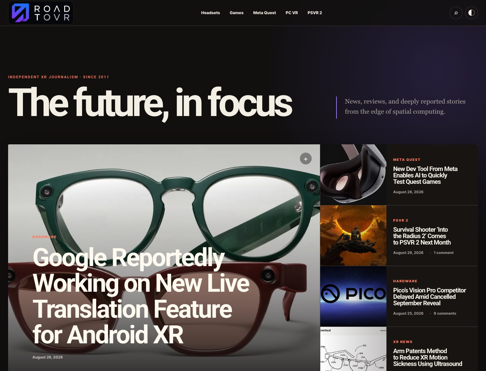
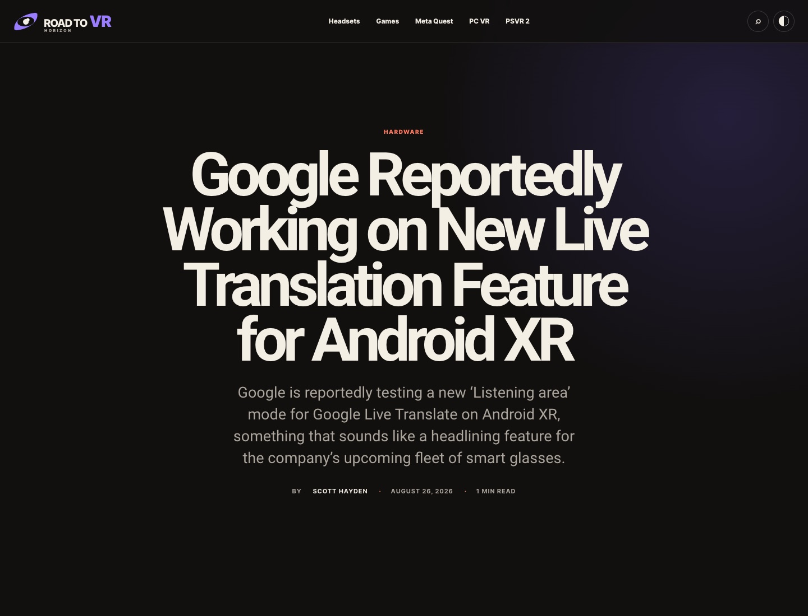
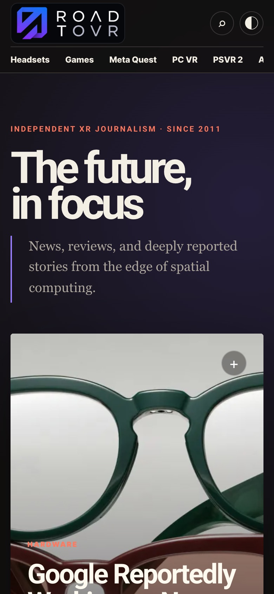

# Road to VR — Horizon

A private, independent Chrome extension that transforms [Road to VR](https://roadtovr.com/) into a bold, modern editorial experience while preserving the publication's reporting, links, images, and comments.

The visual system takes inspiration from the confident hierarchy and energetic pacing of modern culture publications such as Polygon, but uses an original design: warm paper and ink colors, electric-violet accents, cinematic imagery, asymmetric story grids, and subtle motion.

## Preview



| Article reader | Mobile layout |
| --- | --- |
|  |  |

## What it changes

- Rebuilds the home page into a lead-story hero, editorial story grid, latest-news stream, and feature rail.
- Restores featured artwork for source blocks that Road to VR intentionally publishes as text-only cards.
- Hides the legacy page before first paint, replacing it with a brief branded transition surface instead of a flash of the old design.
- Uses the supplied modern Road to VR identity throughout the site, popup, preload screen, and toolbar icon.
- Reflows articles into a distraction-free reader with larger editorial typography, a progress bar, estimated reading time, comfortable line length, and responsive media.
- Shows each article author's profile photo and links the byline back to their Road to VR profile.
- Keeps the original Road to VR Disqus discussion available beneath every article.
- Adds light, dark, and system themes.
- Adds adjustable type size and reading width.
- Adds a private, on-device reading list.
- Respects `prefers-reduced-motion` and uses semantic, keyboard-friendly controls.
- Runs only on Road to VR and does not send analytics or personal data anywhere.

## Install locally

1. Open `chrome://extensions` in Chrome.
2. Enable **Developer mode**.
3. Choose **Load unpacked**.
4. Select this repository folder.
5. Visit or refresh [roadtovr.com](https://roadtovr.com/).

Use the toolbar icon to disable the redesign, choose a theme, tune the reading width, or adjust text size. Changes are applied immediately.

## Development

No build step and no third-party runtime dependencies are required.

```sh
npm run check
npm run test:live
```

`npm run test:live` launches a temporary Chrome for Testing profile, loads the unpacked extension, validates the current Road to VR home and article experiences, and writes local screenshots to `artifacts/`.

Create an installable source archive with:

```sh
npm run package
```

## Project structure

```text
manifest.json          Chrome Manifest V3 configuration
src/bootstrap.js       First-paint guard and preference bootstrap
src/preload.css        Branded transition layer that hides legacy markup
src/content.js         Content extraction and page composition
src/styles.css         Responsive editorial design system
popup/                 Extension controls
scripts/test-live.mjs  Zero-dependency live Chrome smoke test
tests/                 Manifest and source-policy checks
```

## Compatibility

The extractor intentionally targets several stable WordPress/TagDiv patterns and falls back to the original page if it cannot find enough content. Because Road to VR controls its own markup, significant site template changes may require selector updates.

## Status and ownership

This is an unofficial reader extension and is not affiliated with Road to VR or Polygon. Article copy, imagery, marks, and linked material remain the property of their respective owners. The extension changes presentation only; it does not bypass subscriptions, alter editorial content, or redistribute articles.
